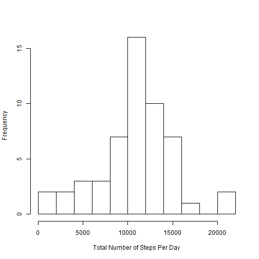
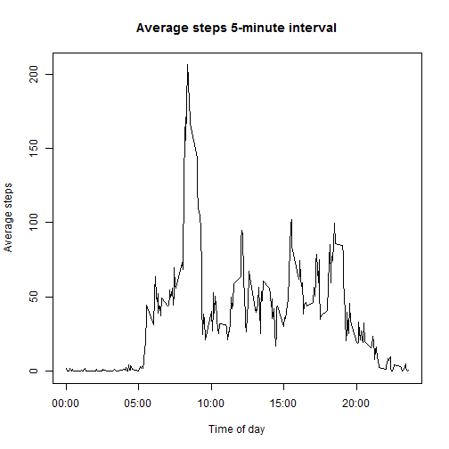
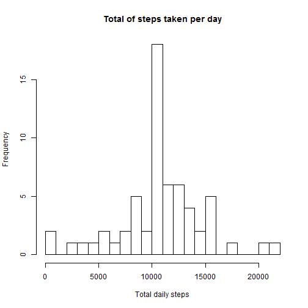
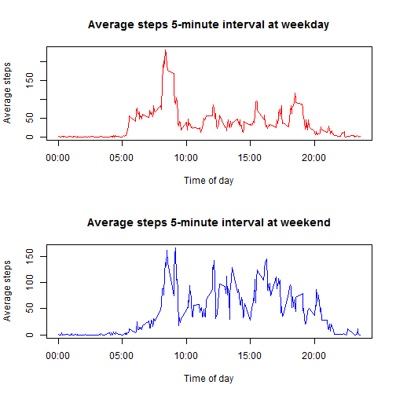

## Introduction

It is now possible to collect a large amount of data about personal
movement using activity monitoring devices such as a
[Fitbit](http://www.fitbit.com), [Nike
Fuelband](http://www.nike.com/us/en_us/c/nikeplus-fuelband), or
[Jawbone Up](https://jawbone.com/up). These type of devices are part of
the "quantified self" movement -- a group of enthusiasts who take
measurements about themselves regularly to improve their health, to
find patterns in their behavior, or because they are tech geeks. But
these data remain under-utilized both because the raw data are hard to
obtain and there is a lack of statistical methods and software for
processing and interpreting the data.


## Loading and preprocessing the data

```r
unzip("activity.zip")
data<-read.csv("activity.csv")
data$date<-as.Date(data$date)
```

## Mean total number of steps taken per day
To calculate and visualize the average total number of steps per day, we will procede as follows:
- Create a new dataset ignoring missing data NA
- Plot a histogram of the total number of steps taken each day
- Report the mean and median total number of steps taken per day


```r
data1<-na.omit(data)
StepsDay<-rowsum(data1$steps, format(data1$date, '%Y-%m-%d'))
StepsDay<-data.frame(StepsDay)
names(StepsDay)<-("steps")
hist(StepsDay$steps, main=" ",
     breaks=10,
     xlab="Total Number of Steps Per Day")
```

 
Mean and Median total number of steps per day:


```r
mean(StepsDay$steps)
```

```
## [1] 10766.19
```

```r
median(StepsDay$steps)
```

```
## [1] 10765
```
## Average daily activity pattern
In this section, we will:
- Calculate average steps for each of 5-minute interval during a 24-hour period.
- Make a time series plot (i.e. type = “l”) of the 5-minute interval (x-axis) and the average number of steps taken, averaged across all days (y-axis)
- Report which 5-minute interval, on average across all the days in the dataset, contains the maximum number of steps?
Observer and comment the average daily activity pattern

```r
data$interval <- as.factor(as.character(data$interval))
interval.mean <- as.numeric(tapply(data$steps, data$interval, mean, na.rm = TRUE))
intervals <- data.frame(intervals = as.numeric(levels(data$interval)), interval.mean)
intervals <- intervals[order(intervals$intervals), ]
```
Plot time series of the 5-minute interval and the average number of steps taken, averaged across all days

```r
labels <- c("00:00", "05:00", "10:00", "15:00", "20:00")
labels.at <- seq(0, 2000, 500)
plot(intervals$intervals, intervals$interval.mean, type = "l", main = "Average steps 5-minute interval", 
    ylab = "Average steps", xlab = "Time of day", xaxt = "n")
axis(side = 1, at = labels.at, labels = labels)
```

 
Report the 5-min interval, on average across all the days in the dataset, contains the maximum number of steps:

```r
intervals.sorted <- intervals[order(intervals$interval.mean, decreasing = TRUE),]
head(intervals.sorted)
```

```
##     intervals interval.mean
## 272       835      206.1698
## 273       840      195.9245
## 275       850      183.3962
## 274       845      179.5660
## 271       830      177.3019
## 269       820      171.1509
```

```r
max.interval <- intervals.sorted$intervals[1[1]]
max.interval
```

```
## [1] 835
```
## Imputing missing values
There are a number of days/intervals where there are missing values (coded as NA). The presence of missing days may introduce bias into some calculations or summaries of the data. In this section we will:

- Calculate and report the total number of missing values in the dataset (i.e. the total number of rows with NAs)
- Implement a strategy for filling in all of the missing values in the dataset. The strategy is to use the mean for the same interval to replace missing valuse. 
- Make a histogram of the total number of steps taken each day
- Calculate and report the mean and median total number of steps taken per day.
- Make following comments: Do these values differ from the estimates from the first part of the assignment? What is the impact of imputing missing data on the estimates of the total daily number of steps?

- the total number of missing values in the dataset (i.e. the total number of rows with NAs) is:

```r
sum(is.na(data))
```

```
## [1] 2304
```
Now, we replace missing data in steps variable:


```r
steps <- vector()
for (i in 1:dim(data)[1]) {
    if (is.na(data$steps[i])) {
        steps <- c(steps, intervals$interval.mean[intervals$intervals == data$interval[i]])
    } else {
        steps <- c(steps, data$steps[i])
    }
}


activity.without.missing.data <- data.frame(steps = steps, date = data$date, 
    interval = data$interval)
```
We check there are no missing data in our new same-sized dataset:

```r
sum(is.na(data))
```

```
## [1] 2304
```
And we plot an histogram of the total number of steps taken each day:

```r
hist(tapply(activity.without.missing.data$steps, activity.without.missing.data$date, 
    sum), xlab = "Total daily steps", breaks = 20, main = "Total of steps taken per day")
```

 
The mean and median steps taken per day in the new dataset are:


```r
total.daily.steps <- as.numeric(tapply(activity.without.missing.data$steps, 
    activity.without.missing.data$date, sum))
step.mean <- mean(total.daily.steps)
step.median <- median(total.daily.steps)
step.mean
```

```
## [1] 10766.19
```

```r
step.median
```

```
## [1] 10766.19
```
The mean and the median are equal. The strategy to fill missing observations had no impact on the structure of our dataset.

## Differences in activity patterns between weekdays and weekends
For this section, we used our new dataset with filled-in missing data. We will:
1. Create a new factor variable in the dataset with two levels – “weekday” and “weekend” indicating whether a given date is a weekday or weekend day.

2. Make a panel plot containing a time series plot (i.e. type = "l") of the 5-minute interval (x-axis) and the average number of steps taken, averaged across all weekday days or weekend days (y-axis). 


```r
## Categorizing weekdays

activity.without.missing.data$day.type <- c("weekend", "weekday", "weekday", 
    "weekday", "weekday", "weekday", "weekend")[as.POSIXlt(activity.without.missing.data$date)$wday + 
    1]
activity.without.missing.data$day.type <- as.factor(activity.without.missing.data$day.type)

weekday <- activity.without.missing.data[activity.without.missing.data$day.type == 
    "weekday", ]
weekend <- activity.without.missing.data[activity.without.missing.data$day.type == 
    "weekend", ]
## Calculating average steps by type of weekday
weekday.means <- as.numeric(tapply(weekday$steps, weekday$interval, mean))
weekend.means <- as.numeric(tapply(weekend$steps, weekend$interval, mean))

intervals.day.type <- data.frame(intervals = as.numeric(levels(data$interval)), 
    weekday.means, weekend.means)
intervals.day.type <- intervals.day.type[order(intervals.day.type$intervals), 
    ]
```
Plot two time series - weekdays and weekends - of the 5-minute intervals and average number of steps taken.


```r
par <- par(mfrow = c(2, 1))
plot(intervals.day.type$intervals, intervals.day.type$weekday.means, type = "l", 
    col = "red", ylab = "Average steps", xlab = "Time of day", main = "Average steps 5-minute interval at weekday", 
    xaxt = "n")
axis(side = 1, at = labels.at, labels = labels)
plot(intervals.day.type$intervals, intervals.day.type$weekend.means, type = "l", 
    col = "blue", ylab = "Average steps", xlab = "Time of day", main = "Average steps 5-minute interval at weekend", 
    xaxt = "n")
axis(side = 1, at = labels.at, labels = labels)
```

 

```r
par(par)
```
As we can see on the plots, there is generally more activity during the weekend, except for the time-period 5-10am, which is the time the person is most probably heading to work.
